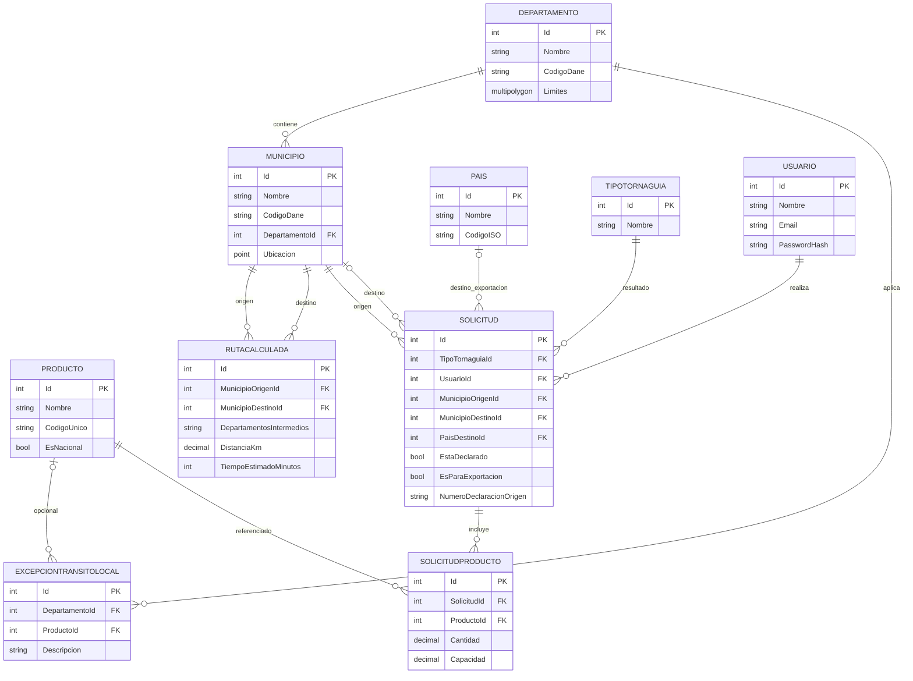

# Diagrama entidad-relación — Tornaguía Asistente

Modelo de datos completo del sistema. Renderizado automáticamente por GitHub
al visualizar este archivo (sintaxis Mermaid).

## Notas del modelo

- `TipoTornaguia` tiene exactamente 3 filas (Movilización, Reenvío, Tránsito) —
  ver `docs/negocio/arbol-decision-motor-reglas.md`. No representa subtipos de
  Tránsito, que son metadata derivada, no almacenada.
- `Solicitud.MunicipioDestinoId` y `Solicitud.PaisDestinoId` son mutuamente
  excluyentes (validado en `Application`, no se puede expresar a nivel de BD).
- `RutaCalculada` y `Solicitud` usan `Municipio` como nivel de origen/destino,
  no `Departamento` — el departamento se deriva navegando la relación.
- `ExcepcionTransitoLocal.ProductoId` es nullable: la excepción puede aplicar
  a nivel de departamento completo o a un producto específico.
